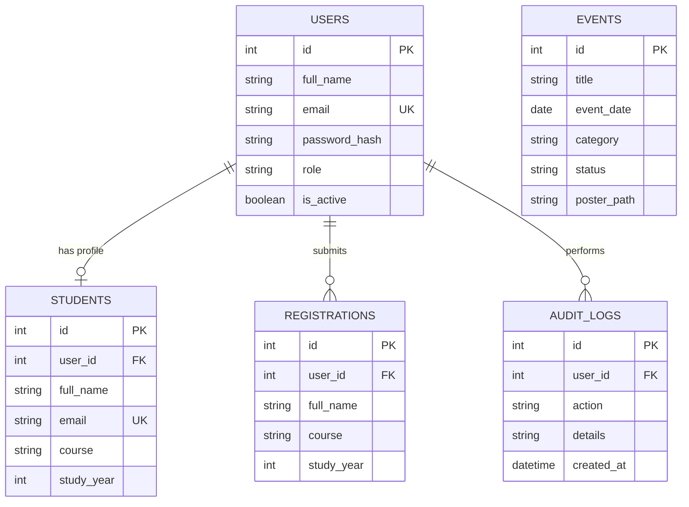

# Student Hub ER model

```mermaid
erDiagram
    USERS ||--o| STUDENTS : "has profile"
    USERS ||--o{ REGISTRATIONS : "submits"
    USERS ||--o{ AUDIT_LOGS : "performs"
    EVENTS {
        int id PK
        string title
        date event_date
        string category
        string status
        string poster_path
    }
    USERS {
        int id PK
        string full_name
        string email UK
        string password_hash
        string role
        boolean is_active
    }
    STUDENTS {
        int id PK
        int user_id FK
        string full_name
        string email UK
        string course
        int study_year
    }
    REGISTRATIONS {
        int id PK
        int user_id FK
        string full_name
        string course
        int study_year
    }
    AUDIT_LOGS {
        int id PK
        int user_id FK
        string action
        string details
        datetime created_at
    }
```
